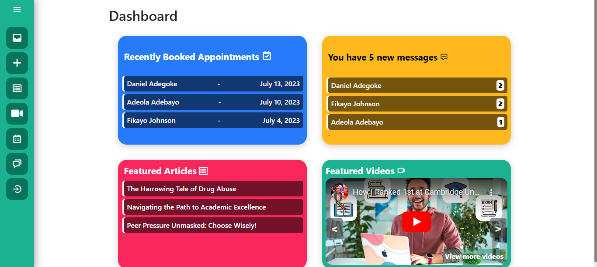
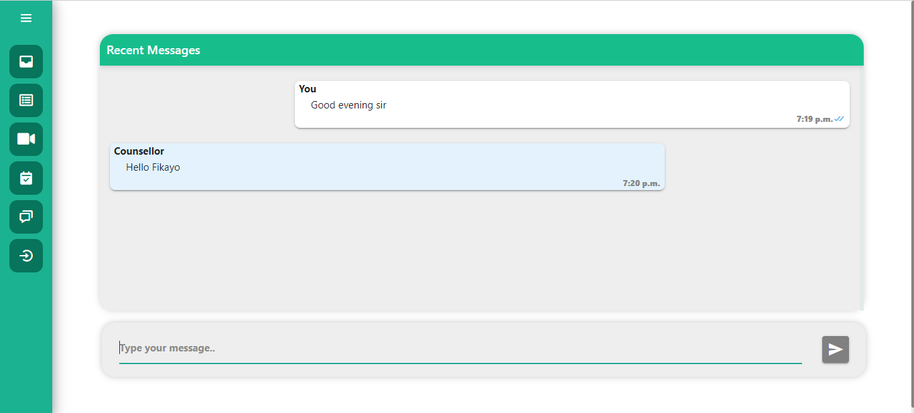
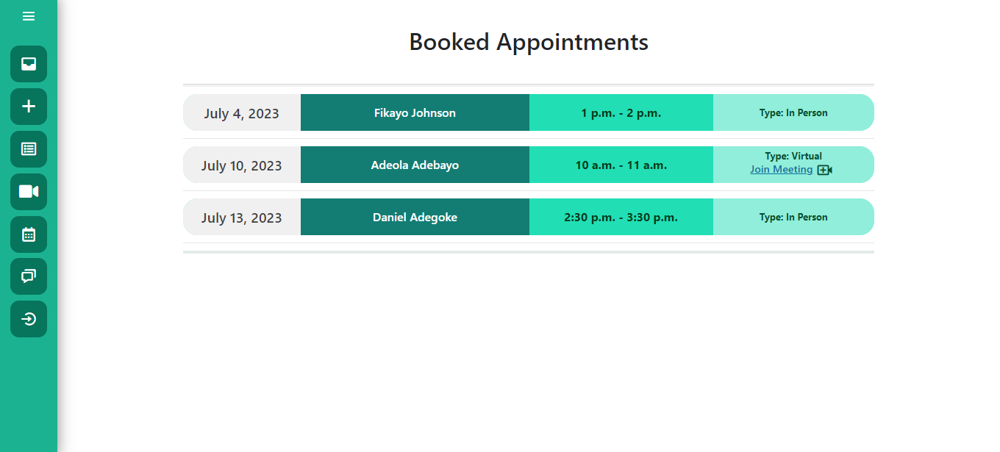

<div align="center">

</div>

<div align="center">
<hr>
<p style="font-size:15px;">An online counseling system designed to offer accessible and convenient counseling services to students. 
Through its web-based resources, live chat feature, and appointment booking options, students can access guidance, support, and professional assistance.</p>
</div>
<hr>

<details><summary><b style="font-size:21px;">App screenshots</summary></b>
    <details><summary><b>Home Page</summary>
        <div align="center">
        
        </div>
    </details>
    <details><summary><b>Counsellor's Dashboard</summary>
        <div align="center">
        
        </div>
    </details>
    <details><summary><b>Student's Live Chat View</summary>
        <div align="center">
        
        </div>
    </details>
    <details><summary><b>Counsellor's Booked Appointments View</summary>
        <div align="center">
        
        </div>
    </details>
</details>
<hr>
# Guidelines on how to run locally 💻

## Clone this repository

```
git clone https://github.com/YoungAli/Real-counselling.git
```

## Change directory
Change your directory to where you cloned the repository

```
cd Real-counselling
```

## Create a virtual environment in the Real-counselling directory
Ensure you are in the Real-counselling directory, run this command to create a virtual environment:
```
python -m venv .\venv
```
## Activate the virtual environment
Activate the virtual environment using the following command: 
```
venv\scripts\activate
```
Note: Upon running the command **venv\scripts\activate**, if this error shows up:
```
venv\scripts\activate : File C:\Users\Training\Documents\New folder\venv\scripts\Activate.ps1 cannot be loaded because running scripts is 
disabled on this system. For more information, see about_Execution_Policies at http://go.microsoft.com/fwlink/?LinkID=135170.
```
Run this command: 
``` 
Set-ExecutionPolicy -Scope CurrentUser -ExecutionPolicy Unrestricted 
```
Then run the command to activate the virtual environment
## Install all necessary packages 

```
pip install -r requirements.txt
```

## Make migrations
Run the following commands separately to make migrations
```
python manage.py makemigrations
python manage.py migrate
```
## Create a new superuser
Run the following command to create a new superuser
```
python manage.py createsuperuser
```

## Run the project

```
python manage.py runserver
```

# License 🔐
This project is under an [MIT LICENSE](LICENSE)

